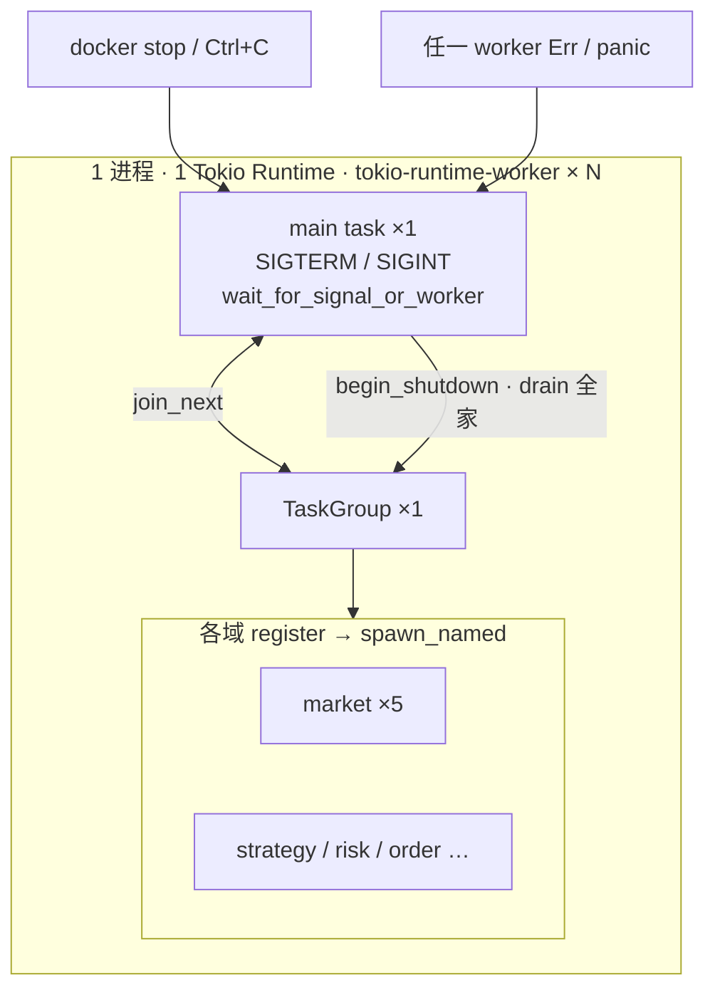

# rust-engine

事件驱动的模块化单体：连接 IB Gateway，采集行情并本地落盘。当前只实现 **market** 域；**strategy / risk / order** 预留占位。

开发与生产均在 **Docker（Linux）** 内运行；单进程、单 Tokio runtime，各域通过进程内 channel 通信。

主链（目标）：`market → strategy → risk → order`

## 域划分

| 域 | 状态 | 一句话 |
|----|------|--------|
| **market** | 已实现 | IB 连接、订阅、事件标准化、内存盘口、分段写盘、快照、健康检查 |
| **strategy** | 预留 | 消费 market 输出，产生交易信号或下单意图 |
| **risk** | 预留 | 对 strategy 交易意图做预交易审查与约束（限额、kill switch） |
| **order** | 预留 | 订单生命周期与 broker 执行 |

## 目录

```
conf/
├── config.yaml                 # 入口配置（基础设施 + 外部文件路径）
└── market/
    └── subscriptions.yaml      # 订阅标的

src/
├── main.rs                     # 入口、信号、graceful shutdown
├── logging.rs                  # 文件 + stdout 日志（含线程名）
├── core/
│   ├── config/                 # conf/ yaml 加载
│   ├── wal/                    # 域无关 WAL（rotation、checkpoint、读写）
│   ├── model/                  # 跨域共享类型（MarketEvent、Symbol…）
│   ├── pipeline/               # EventPublisher、bounded channel
│   ├── task.rs                 # TaskGroup · wait_for_signal_or_worker · EngineStop
├── market/
│   ├── phase.rs                # MarketPhase（域内 IB 连接编排，watch 广播）
│   ├── runtime.rs              # register() 向顶层 TaskGroup 注册 worker
│   ├── config.rs               # IB / 存储 / 管道配置模型
│   ├── connection/             # supervisor、session、IB adapter
│   ├── subscription/           # desired → active reconcile
│   ├── recorder/               # market 域 WAL 消费（event 写入）
│   ├── wal/                      # market 域 WAL 记录 schema
│   ├── state/                  # 内存盘口
│   ├── snapshot/               # 周期导出
│   └── health/
├── strategy/                   # 预留
├── risk/                       # 预留
└── order/                      # 预留
```

## 配置

看 `conf/config.yaml` 和 `conf/market/subscriptions.yaml` 即可；yaml 里已有注释。运行时还需环境变量 `TRADING_MODE`（`paper` / `live`）。

### WAL 落盘

单条 log 交错写入 **event** 与 **snapshot**，全局单调 `seq`：

```json
{"kind":"event","seq":1,"ts_ns":...,"event":{"Connection":...}}
{"kind":"event","seq":2,"ts_ns":...,"event":{"Depth":...}}
{"kind":"snapshot","seq":3,"ts_ns":...,"as_of_seq":2,"books":[...]}
```

- 根目录：`storage.data_dir`（默认 `./data`）；market 域 WAL：`./data/market/`
- 段文件：按 UTC 小时 `wal-YYYYMMDDHH.jsonl`（超出 `segment_max_bytes` 时 `-002` 分片）
- checkpoint：`./data/market/wal.meta`
- 明文 JSONL，可 `tail -f` 边写边读
- 通用读写：[`core::wal`](src/core/wal/mod.rs)；market 记录类型：[`market::wal`](src/market/wal/mod.rs)

```bash
tail -f data/market/wal-$(date -u +%Y%m%d%H).jsonl | jq .
```

## 启动

```bash
# 编辑 conf/config.yaml 与 conf/market/subscriptions.yaml 后
cargo run

# 开发热重载
cargo watch -x run

# 格式化（编辑器保存时会自动 fmt；提交前或批量改代码后可手动跑）
cargo fmt --all
```

二进制名：`engine`（`Cargo.toml` 中 `[[bin]] name = "engine"`）。

生产镜像入口为 `CMD ["./engine"]`；停服时 Docker 向 PID 1 发 **SIGTERM**。

## 运行时结构

`main.rs` 持有一个顶层 [`TaskGroup`](src/core/task.rs)，各域 `register` 注册 worker；`wait_for_signal_or_worker` 统一等信号或 worker 退出。

| Worker（async task） | 职责 |
|--------------------|------|
| `market-connection` | IB 连接 supervisor，写 `MarketPhase`，跑 session reader |
| `market-subscription` | 读 `MarketPhase`，`Connected` 时 reconcile 订阅 |
| `market-recorder` | 消费 `MarketEvent`，写 WAL（event + 内存盘口更新） |
| `market-snapshot` | 定时把盘口快照写入同一 WAL |
| `market-health` | 周期 health tick |

`MarketPhase`（`watch`，仅 market 域）是 IB 连接编排阶段；`MarketEvent::Connection` 是落盘/下游用的领域事件，两者职责不同。

## 并发模型

不是「一个 worker 一个 OS 线程」：**只有 main task 监听 OS 信号**；各域 worker 注册进同一个顶层 `TaskGroup`，由 `wait_for_signal_or_worker` 统一 `join`。



触发 shutdown 后：`broadcast` 通知 worker → 各域 `begin_shutdown` → `TaskGroup::drain`。worker 失败也会走完整 drain，进程最后以非 0 退出（`EngineStop::worker_error`）。
